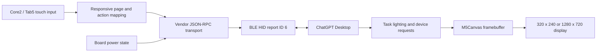

# M5Stack Core2 / Tab5 / StickS3 Codex Micro

[简体中文](README.zh-CN.md)

An independent, open-source compatibility firmware that turns an M5Stack Core2,
Tab5, or StickS3 into a controller for Codex Micro features in the ChatGPT
desktop app. Core2 uses Bluetooth; Tab5 and StickS3 can use either Bluetooth or
USB.

The firmware presents the Core2 as a BLE vendor HID device and provides a
touchscreen interface for six Agent Keys, six Command Keys, four analog-stick
directions, and dial actions. Task status colors, battery state, command
remapping, and push-to-talk integration are handled by ChatGPT Desktop.

> [!IMPORTANT]
> This project is an unofficial compatibility implementation. It is not
> affiliated with, endorsed by, sponsored by, or supported by OpenAI, Work
> Louder, or M5Stack. It uses an undocumented vendor protocol that may change
> without notice. See [NOTICE.md](NOTICE.md) before using or redistributing it.

## Features

- Six touchscreen Agent Keys with task status colors and breathing animation
- Six default Command Keys: Fast, Approve, Decline, Fork, Mic, and Send
- Four touchscreen directions for actions assigned to the analog stick
- Dial counterclockwise, clockwise, press, and 500 ms hold behavior
- ChatGPT Desktop command and direction remapping
- Battery reporting through the Codex Micro device-status protocol
- Automatic BLE advertising after disconnection
- Persisted Bluetooth/USB transport selection on StickS3 and Tab5
- Responsive, flicker-free interface using a full-screen, PSRAM-backed `M5Canvas`

This is a vendor-control surface, not a general-purpose Bluetooth keyboard.

## Compatibility

| Component | Supported or tested state |
| --- | --- |
| Hardware | M5Stack Core2 validated; M5Stack Tab5 and StickS3 builds supported |
| Host OS | macOS tested; Windows compatibility requires physical validation |
| Host app | ChatGPT Desktop with Codex Micro support |
| Transport | Core2: BLE HID; Tab5/StickS3: selectable BLE or USB vendor HID |
| Build system | PlatformIO with Arduino framework |

The implementation was validated on physical Core2 hardware with ChatGPT
Desktop on July 16, 2026. USB firmware builds successfully for StickS3 and
Tab5, but USB enumeration and bidirectional traffic still require validation on
physical macOS and Windows hosts.

## Requirements

- M5Stack Core2 or M5Stack Tab5
- A data-capable USB-C cable for flashing
- [PlatformIO Core](https://docs.platformio.org/en/latest/core/index.html) or
  the PlatformIO IDE extension
- ChatGPT Desktop with Codex Micro support
- macOS Input Monitoring permission for ChatGPT

## Build and flash

Clone the repository and use the build wrapper for your platform. It gives each
board an isolated PlatformIO package directory while retaining the shared
PlatformIO runtime and download cache.

On macOS or Linux:

```sh
bash ./scripts/build.sh core2
bash ./scripts/build.sh core2 --target upload

# Or, for Tab5:
bash ./scripts/build.sh tab5
bash ./scripts/build.sh tab5 --target upload

# Build both targets without sharing framework packages:
bash ./scripts/build.sh all
```

On Windows PowerShell:

```powershell
./scripts/build.ps1 core2
./scripts/build.ps1 core2 --target upload

# Or, for Tab5:
./scripts/build.ps1 tab5
./scripts/build.ps1 tab5 --target upload

# Build both targets without sharing framework packages:
./scripts/build.ps1 all

pio device monitor
```

PlatformIO installs the pinned ESP32 platform and the declared Arduino
libraries automatically. The serial monitor runs at `115200` baud. A successful
boot prints:

```text
CODEX_MICRO_READY
```

The normal application binary is generated at:

```text
.pio/build-core2/m5stack-core2/firmware.bin
.pio/build-tab5/m5stack-tab5/firmware.bin
.pio/build-tab5/m5stack-tab5/firmware.factory.bin
```

Core2 and Tab5 intentionally use incompatible Arduino-ESP32 generations. Tab5
also applies a pinned NimBLE compatibility patch during its build. Avoid direct
mixed `pio run` invocations backed by one package directory: they can replace or
modify framework files needed by the other target. The wrapper stores packages
under `.pio-packages/core2` and `.pio-packages/tab5`. It also uses
`.pio/build-core2` and `.pio/build-tab5`, preventing PlatformIO's shared project
checksum from invalidating the other board's objects. Deleting a package
directory is safe and causes PlatformIO to reinstall that target's packages on
its next build.

To inspect removable PlatformIO downloads and caches before pruning them, run
`pio system prune --dry-run`. Run `pio system prune` only after reviewing that
output. Build outputs can be cleaned without removing installed packages with
`bash ./scripts/build.sh all --target clean` on macOS/Linux or
`./scripts/build.ps1 all --target clean` on Windows.

## Connect to ChatGPT Desktop

1. Flash the firmware and restart the device. New installations start in
   Bluetooth mode.
2. In Bluetooth mode, pair the device named **Codex Micro** in the operating
   system's Bluetooth settings. In USB mode, connect the StickS3 or the Tab5's
   USB-C OTG port with a data-capable cable.
3. Open ChatGPT Desktop. Allow **Input Monitoring** when macOS prompts for it.
4. Open **Settings > Codex Micro** after the device is detected.
5. Choose Agent Key assignments, Command Key actions, analog directions, and
   dial behavior. This firmware visualizes task status colors but does not
   reproduce the original keyboard's ambient or per-key lighting.

If macOS cached an older HID descriptor, forget **Codex Micro** in Bluetooth
settings, restart the Core2, and pair it again.

OpenAI's official Codex Micro usage documentation is available at
[learn.chatgpt.com](https://learn.chatgpt.com/docs/features/codex-micro).
Instructions specific to the original keyboard's physical connection selector,
lighting hardware, and extra layers do not apply to this firmware.

### Select Bluetooth or USB

StickS3 and Tab5 use one transport at a time. On StickS3, open **Config** and
select the transport row. On Tab5, open **Settings** and tap the transport row.
Confirm the change; the firmware saves it and restarts. Connecting a USB cable
while Bluetooth is selected supplies power but does not change transports.
Bluetooth unpair controls are unavailable while USB mode is active.

## Controls

### StickS3

StickS3 uses a portrait, non-touch four-page interface. **Agents** shows six
numbered tiles in a 2 x 3 grid; **Commands** uses large labels plus tick/cross
icons; **Navigate** provides directions and dial actions; **Config** provides
Unpair, transport, and volume controls. Select the bottom `<` or `>` tiles to
change pages; the same
arrow remains selected on the destination page for quick repeated navigation.

Press the main button (`BtnA`) to activate the selected tile. Single-press the
side button (`BtnB`) for the next tile, double-press within 350 ms for the
previous tile, or hold for 500 ms for the next page. Host activity always updates
the selected Agent, prioritizing approval/error states, without changing the
visible page. Mute persists across restarts. Unpair requires explicit cross/tick
confirmation.

Build and upload StickS3 with:

```sh
pio run -e m5stack-sticks3
pio run -e m5stack-sticks3 -t upload
```

The bottom touchscreen tabs switch between the three pages. Core2's A, B, and C
touch buttons provide additional shortcuts; Tab5 uses the on-screen tabs.

### Unpair

Press and hold the `PAIR` or `LIVE` status area in the upper-right corner for
three seconds. The progress indicator must reach 100%; releasing early cancels
the operation. The firmware disconnects the current host, removes all bonds
stored on the device, and resumes advertising without rebooting.

After `UNPAIRED — FORGET ON HOST` appears, also forget **Codex Micro** in the
computer's Bluetooth settings. Device-side unpairing cannot remove the Bluetooth
record stored by macOS.

If the host record was forgotten first, Tab5 clears its complete local NimBLE
bond store. If the hosted Bluetooth stack cannot complete that operation while
running, the firmware automatically restarts once and retries; no physical reset
is required.

### Tasks page

| Control | Behavior |
| --- | --- |
| Agent 1 to Agent 6 | Select the corresponding Codex task slot |
| Colored border and dot | Show the status color sent by ChatGPT Desktop |
| Breathing border | Show an animated status supplied by the host |

### Commands page

| Key | Default ChatGPT Desktop action |
| --- | --- |
| Fast | Toggle Fast mode |
| Approve | Approve the current request |
| Decline | Decline the current request |
| Fork | Continue in a new task |
| Mic | Hold for push-to-talk; double-press behavior is handled by the host |
| Send | Send the composer message |

The Mic action uses the computer's microphone. The Core2 microphone is not
captured or streamed by this firmware.

### Navigate page

- `UP`, `RIGHT`, `DOWN`, and `LEFT` emulate the four analog-stick directions.
- `CCW` and `CW` emulate one dial step in each direction.
- Tap `DIAL` to press the dial.
- Hold `DIAL` for at least 500 ms to request Codex Micro settings.

Mappings are selected in ChatGPT Desktop. Labels on the Core2 show the original
default layout and do not change after host-side remapping.

## Architecture



See [docs/TECHNICAL.md](docs/TECHNICAL.md) for the HID descriptor, report
framing, RPC methods, concurrency model, rendering path, and known protocol
limitations.

## Project layout

```text
include/CodexMicroBle.h   BLE transport and shared state declarations
src/CodexMicroBle.cpp     HID descriptor, framing, and RPC handling
src/main.cpp              Core2 UI, touch mapping, battery, and render loop
docs/TECHNICAL.md         Implementation and protocol notes
platformio.ini            Reproducible PlatformIO environment
LICENSE                   MIT License
NOTICE.md                 Copyright, trademarks, and disclaimers
```

## Troubleshooting

### Device is not listed in Bluetooth settings

- Confirm the display header shows `PAIR`.
- Restart the Core2 and scan again.
- If it was paired previously, forget the old Bluetooth record first.

### ChatGPT Desktop does not detect the device

- Confirm macOS shows the device as connected.
- Quit and reopen ChatGPT Desktop after granting Input Monitoring.
- Open **System Settings > Privacy & Security > Input Monitoring** and ensure
  ChatGPT is enabled.
- Forget and re-pair the device if the firmware's HID descriptor changed.

### A previously paired host will not reconnect

If the device was locally unpaired, forget **Codex Micro** in the host Bluetooth
settings, then pair it again. Clearing only one side leaves mismatched bonding
keys and prevents automatic reconnection.

### Display shows `Canvas allocation failed`

The full-screen 16-bit framebuffer could not be allocated. Restart the device.
If it persists, verify that PSRAM is working and that the PlatformIO environment
matches the connected board.

### Tab5 remains on `STARTING BLE`

Tab5's ESP32-P4 has no radio; BLE is provided by the onboard ESP32-C6 over
SDIO. First power-cycle the Tab5 and retry with its factory C6 firmware. If the
serial log reports `sdio_wrapper`, `H_SDIO_DRV`, or `ensure_slave_bus_ready`,
update the C6 with the companion image shipped for the pinned Arduino-ESP32
3.3.9 / ESP-Hosted release. Follow Espressif's
[ESP-Hosted SDIO update guide](https://github.com/espressif/esp-hosted-mcu/blob/main/docs/sdio.md) and use its matching C6 image; keep a copy of the factory image and do not flash an unrelated C6 build. This repository intentionally does not redistribute a coprocessor binary.

### Serial diagnostics

Use `pio device monitor`. Useful messages include BLE pairing status, host
connection state, received RPC method names, and emitted key actions. Do not
publish serial logs without checking them for environment-specific information.

## Security and limitations

- BLE pairing uses bonding with a no-input/no-output, "Just Works" flow. Pair
  only in a trusted environment.
- Holding the upper-right connection status for three seconds clears every bond
  stored on the device; it does not alter the host's saved Bluetooth record.
- The firmware has no network client and does not contact OpenAI directly.
  Control events and battery state are sent to the paired host over Bluetooth.
- The vendor HID identifiers and protocol are used solely for compatibility and
  are not assigned to or owned by this project.
- Protocol compatibility may break after a ChatGPT Desktop update.
- Only one BLE host connection is supported at a time.
- The implementation does not reproduce the original keyboard's USB transport,
  physical keys, analog input, LEDs, extra layers, or firmware updater.

## Contributing

Issues and pull requests are welcome. When reporting a compatibility problem,
include the Core2 hardware revision, host OS version, ChatGPT Desktop version,
serial output with private information removed, and exact reproduction steps.

Keep protocol changes narrowly scoped and document whether they were observed,
inferred, or verified on hardware.

## License

Copyright (c) 2026 imliubo.

Source code and project documentation are licensed under the
[MIT License](LICENSE). Third-party product names, trademarks, protocol
identifiers, and dependencies remain the property of their respective owners
and are not granted under this license. See [NOTICE.md](NOTICE.md).
