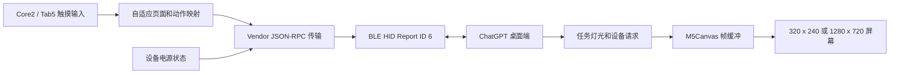

# M5Stack Core2 / Tab5 Codex Micro

[English](README.md)

这是一个独立开发的开源兼容固件，可将 M5Stack Core2 或 Tab5 变成 ChatGPT 桌面端
Codex Micro 功能的蓝牙控制器。

固件将 Core2 模拟为 BLE Vendor HID 设备，并通过触摸屏提供 6 个 Agent Key、
6 个 Command Key、4 个摇杆方向和旋钮操作。任务状态颜色、电池状态、按键映射
和按住说话功能由 ChatGPT 桌面端处理。

> [!IMPORTANT]
> 本项目是非官方兼容实现，与 OpenAI、Work Louder 或 M5Stack 没有隶属、授权、
> 赞助、背书或技术支持关系。项目使用未公开的厂商协议，该协议可能随时发生变化。
> 使用或分发前请阅读 [NOTICE.md](NOTICE.md)。

## 功能

- 6 个触摸式 Agent Key，显示任务状态颜色和呼吸动画
- 6 个默认 Command Key：Fast、Approve、Decline、Fork、Mic、Send
- 4 个触摸方向键，对应摇杆的四个方向
- 旋钮逆时针、顺时针、按下和按住 500 ms 操作
- 支持在 ChatGPT 桌面端重新映射命令键和方向动作
- 通过 BLE HID 上报 Core2 或 Tab5 电池状态
- 断开连接后自动重新广播
- 使用 PSRAM 全屏 `M5Canvas` 双缓冲，实现适配屏幕尺寸且无明显闪烁的界面

本项目是 Codex 控制器，不是通用蓝牙键盘。

## 兼容性

| 项目 | 支持或测试状态 |
| --- | --- |
| 硬件 | M5Stack Core2 已完成实机验证；支持构建 M5Stack Tab5 固件 |
| 主机系统 | 已测试 macOS |
| 主机应用 | 支持 Codex Micro 的 ChatGPT 桌面端 |
| 通信方式 | 仅支持 Bluetooth Low Energy HID |
| 构建系统 | PlatformIO + Arduino Framework |

本项目于 2026 年 7 月 16 日在真实 Core2 硬件和 ChatGPT 桌面端上完成验证。
其他 Core2 修订版、其他操作系统、USB 控制和 Work Louder Input 尚未验证。

## 准备工作

- M5Stack Core2 或 M5Stack Tab5
- 支持数据传输的 USB-C 线
- [PlatformIO Core](https://docs.platformio.org/en/latest/core/index.html) 或
  PlatformIO IDE 扩展
- 支持 Codex Micro 的 ChatGPT 桌面端
- macOS 上为 ChatGPT 开启“输入监控”权限

## 编译和烧录

克隆仓库后执行：

```sh
pio run -e m5stack-core2
pio run -e m5stack-core2 --target upload

# Tab5 使用：
pio run -e m5stack-tab5
pio run -e m5stack-tab5 --target upload
pio device monitor
```

PlatformIO 会自动安装工程锁定的 ESP32 平台和声明的 Arduino 库。串口监视器
波特率为 `115200`。启动成功后会输出：

```text
CODEX_MICRO_READY
```

常规应用固件位于：

```text
.pio/build/m5stack-core2/firmware.bin
.pio/build/m5stack-tab5/firmware.bin
.pio/build/m5stack-tab5/firmware.factory.bin
```

## 与 ChatGPT 桌面端配对

1. 烧录固件并重启 Core2。
2. 打开 macOS 蓝牙设置，与名为 **Codex Micro** 的设备配对。
3. 打开 ChatGPT 桌面端，并在 macOS 提示时允许“输入监控”。
4. 设备被识别后，打开 **Settings > Codex Micro**。
5. 设置 Agent Key 任务、Command Key 动作、摇杆方向和旋钮行为。本固件会显示任务
   状态颜色，但不复刻原键盘的环境灯光或逐键灯光。

如果 macOS 缓存过旧版 HID 描述符，请先在蓝牙设置中忽略 **Codex Micro**，
重启 Core2 后重新配对。

OpenAI 官方 Codex Micro 使用说明位于
[learn.chatgpt.com](https://learn.chatgpt.com/docs/features/codex-micro)。原键盘的
USB 模式、物理配对控件、灯光硬件和额外层说明不适用于本 Core2 固件。

## 操作说明

屏幕底部标签可切换三个页面。Core2 还可使用 A、B、C 触摸按钮快捷切换；
Tab5 使用屏幕标签。

### Tasks 页面

| 控件 | 行为 |
| --- | --- |
| Agent 1 至 Agent 6 | 选择对应的 Codex 任务槽位 |
| 彩色边框和圆点 | 显示 ChatGPT 桌面端下发的任务状态颜色 |
| 呼吸边框 | 显示主机下发的动态状态 |

### Commands 页面

| 按键 | ChatGPT 桌面端默认动作 |
| --- | --- |
| Fast | 开关 Fast 模式 |
| Approve | 批准当前请求 |
| Decline | 拒绝当前请求 |
| Fork | 在新任务中继续当前任务 |
| Mic | 按住说话；双击行为由主机处理 |
| Send | 发送编辑框中的消息 |

Mic 动作使用电脑麦克风。本固件不会采集或通过蓝牙传输 Core2 麦克风音频。

### Navigate 页面

- `UP`、`RIGHT`、`DOWN`、`LEFT` 模拟摇杆的四个方向。
- `CCW` 和 `CW` 分别模拟一次旋钮逆时针和顺时针步进。
- 点击 `DIAL` 模拟按下旋钮。
- 按住 `DIAL` 至少 500 ms，请求打开 Codex Micro 设置。

动作映射由 ChatGPT 桌面端选择。Core2 上的标签显示原始默认布局，在主机端
重新映射后不会同步改变。

## 架构



HID 描述符、报告分帧、RPC 方法、并发模型、渲染流程和协议限制详见
[docs/TECHNICAL.zh-CN.md](docs/TECHNICAL.zh-CN.md)。

## 工程结构

```text
include/CodexMicroBle.h   BLE 传输和共享状态声明
src/CodexMicroBle.cpp     HID 描述符、分帧和 RPC 处理
src/main.cpp              Core2 界面、触摸映射、电池和渲染循环
docs/TECHNICAL.zh-CN.md   实现和协议说明
platformio.ini            可复现的 PlatformIO 环境
LICENSE                   MIT License
NOTICE.md                 版权、商标和免责声明
```

## 故障排查

### 蓝牙设置中找不到设备

- 确认屏幕右上角显示 `PAIR`。
- 重启 Core2 后重新扫描。
- 如果曾经配对过，先忽略旧蓝牙记录。

### ChatGPT 桌面端没有识别设备

- 确认 macOS 显示设备已连接。
- 授予“输入监控”权限后，完全退出并重新打开 ChatGPT。
- 打开“系统设置 > 隐私与安全性 > 输入监控”，确认 ChatGPT 已开启。
- 如果固件 HID 描述符发生过变化，请忽略设备并重新配对。

### 屏幕显示 `Canvas allocation failed`

固件无法分配全屏 16 位帧缓冲。请先重启设备；如果问题持续出现，请确认 PSRAM
正常，并确保 PlatformIO 环境与连接的开发板一致。

### Tab5 停留在 `STARTING BLE`

Tab5 的 ESP32-P4 本身没有无线电，BLE 由板载 ESP32-C6 通过 SDIO 提供。先将
Tab5 完全断电后重试出厂 C6 固件。如果串口出现 `sdio_wrapper`、`H_SDIO_DRV`
或 `ensure_slave_bus_ready`，请使用与本项目固定的 Arduino-ESP32 3.3.9 / ESP-Hosted
版本匹配的 C6 镜像。按照 Espressif 的
[ESP-Hosted SDIO 更新指南](https://github.com/espressif/esp-hosted-mcu/blob/main/docs/sdio.md)
更新，并保留出厂镜像备份；不要烧录不匹配的 C6 固件。本仓库不分发协处理器镜像。

### 串口诊断

运行 `pio device monitor`。日志会显示 BLE 配对结果、主机连接状态、收到的 RPC
方法名称和发送的按键动作。公开日志前，请先检查并移除与本机环境有关的信息。

## 安全与限制

- BLE 采用绑定和无输入/无输出的“Just Works”配对方式，请只在可信环境中配对。
- 固件不包含网络客户端，也不会直接连接 OpenAI。控制事件和电池状态仅通过蓝牙
  发送给已配对主机。
- Vendor HID 标识和协议仅用于兼容性，不属于也未分配给本项目。
- ChatGPT 桌面端更新后，协议兼容性可能失效。
- 同一时间只支持一个 BLE 主机连接。
- 本项目不复刻原键盘的 USB 传输、物理按键、模拟摇杆、LED、额外层或固件更新器。

## 参与贡献

欢迎提交 Issue 和 Pull Request。报告兼容性问题时，请提供 Core2 硬件版本、主机
系统版本、ChatGPT 桌面端版本、已移除隐私信息的串口日志和完整复现步骤。

协议改动应保持范围明确，并注明结论来自实际观察、合理推断还是硬件验证。

## 许可证

Copyright (c) 2026 imliubo.

源代码和项目文档采用 [MIT License](LICENSE) 发布。第三方产品名称、商标、协议
标识和依赖仍归其各自权利人所有，不属于本许可证的授权范围。详见
[NOTICE.md](NOTICE.md)。
