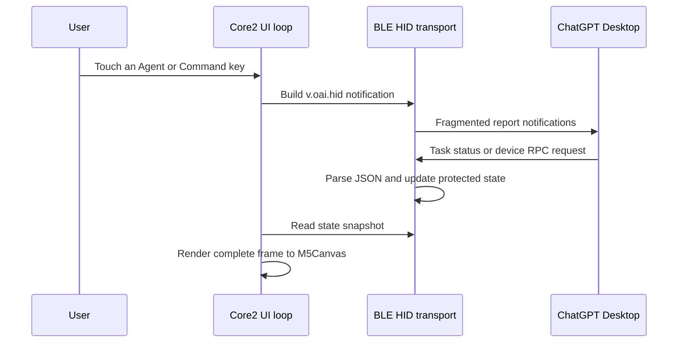

# Technical Notes

[简体中文](TECHNICAL.zh-CN.md)

This document describes the implementation shipped in this repository. The
wire protocol is undocumented by its vendors; details below are observations
and compatibility behavior, not a stable or official API specification.

## System overview

The firmware has two main layers:

1. `src/main.cpp` owns the board display, responsive touch hit testing, page state,
   battery polling, and render loop.
2. `src/CodexMicroBle.cpp` owns BLE setup, the HID descriptor, report framing,
   JSON parsing, host request handling, and notifications sent to the host.

The Arduino loop reads an immutable snapshot of BLE-owned state. A FreeRTOS
mutex protects connection and lighting data that can be changed from BLE
callbacks.

## Build environment

StickS3 uses its own `main_sticks3.cpp` entry point and the
`m5stack-sticks3` environment. It targets the ESP32-S3 with 8 MB flash/PSRAM,
M5Unified 0.2.12, and a native 135 x 240 16-bit canvas. Its hardware-independent
controller separates delayed single clicks, double clicks, holds, page/grid
selection, and unpair confirmation from display and BLE work.

Each thread update carries a monotonically increasing order value. StickS3 uses
those values to select the latest changed Agent, preferring waiting/error states
within a batch. This stored Agent selection is independent of the visible page.

The two PlatformIO environments are intentionally pinned:

| Setting | Value |
| --- | --- |
| Core2 platform / board | `espressif32@6.13.0` / `m5stack-core2` |
| Tab5 platform / board | Pioarduino `55.03.39` / `m5stack-tab5-p4` |
| Framework | Arduino |
| Serial monitor | 115200 baud |
| Upload speed | 1,500,000 baud |
| Display and hardware library | `M5Unified 0.2.10` |
| JSON library | `ArduinoJson 6.21.5` |

Core2 uses Arduino-ESP32 2.x Bluedroid. Tab5 uses Arduino-ESP32 3.3.9 NimBLE
with its ESP32-C6 controller reached through ESP-Hosted over SDIO. Compile-time
adapters cover callback and characteristic-value API differences. Upgrading either platform can
change BLE field serialization, callback APIs, memory use, or pairing behavior
and must be verified on a clean host pairing.

## BLE HID identity

The device advertises as a generic BLE HID device with these compatibility
values:

| Field | Value |
| --- | --- |
| Device name | `Codex Micro` |
| Manufacturer string | `Work Louder` |
| Vendor ID | `0x303A` |
| Product ID | `0x8360` |
| PnP source | `0x02` |
| HID usage page | Vendor Defined `0xFF00` |
| Application usage | `0x01` |
| Report ID | `6` |
| Input report body | 63 bytes |
| Output report body | 63 bytes |

These names and identifiers are not assigned to this project. They are emitted
only because the host uses them for compatibility detection. Do not reuse them
for an unrelated product or imply that a device is official hardware.

The selected Arduino BLE implementations serialize the PnP fields in a byte
order that differs from the BLE PnP characteristic. Both targets pre-swap the
16-bit fields so macOS observes the intended values.

## HID report descriptor

The descriptor declares one vendor-defined application collection containing
one 63-byte input report and one 63-byte output report under Report ID 6. Every
item uses an 8-bit report size and a logical range of 0 to 255.

On normal BLE HOGP paths, the report ID selects the characteristic and is not
part of the 63-byte characteristic value. The receive path also accepts a
64-byte variant with an explicit leading Report ID 6 for host bridges that
forward the raw report.

## Transport framing

Each report body has this layout:

| Offset | Size | Meaning |
| --- | --- | --- |
| 0 | 1 byte | Message type, currently `2` |
| 1 | 1 byte | Payload length, `0` to `61` |
| 2 | Up to 61 bytes | UTF-8 JSON fragment |
| Remaining | Variable | Zero padding to a 63-byte report body |

Outgoing JSON is terminated with `\n`, divided into chunks of at most 61 bytes,
and sent as fixed-size 63-byte input notifications. A 4 ms delay is inserted
between fragments.

Incoming output reports are appended to a string buffer and parsed with a
4096-byte `DynamicJsonDocument`. `IncompleteInput` retains the buffer for the
next fragment. A new fragment beginning with `{"method"` resets an incomplete
buffer, which allows the receiver to recover after a dropped request. Malformed
JSON clears the buffer and writes a parse error to the serial log.

The transport does not currently include sequence numbers, acknowledgements,
checksums, retransmission, flow-control negotiation, encryption above BLE, or a
maximum accumulated string-buffer guard.

## RPC messages

Messages follow a compact JSON-RPC-like shape. Host requests include `method`,
usually `params`, and an `id`. Responses echo `id` and include either `result`
or `error`. Device events omit `id`.

### Device to host

| Method | Parameters | Purpose |
| --- | --- | --- |
| `v.oai.hid` | `k`: key ID, `act`: action, optional `ag`: Agent index | Key press or release |
| `v.oai.rad` | `a`: normalized angle, `d`: distance | Analog-direction press or release |

Key actions used by the firmware:

- `act = 0`: release
- `act = 1`: press
- `act = 2`: one encoder step

Agent IDs are `AG00` through `AG05`. Default command IDs are `ACT06`, `ACT07`,
`ACT08`, `ACT09`, `ACT10`, and `ACT12`. Encoder IDs are `ENC_CC`, `ENC_CW`, and
`ENC`.

Directional angles are normalized turns rather than radians:

| Direction | Angle | Press distance | Release distance |
| --- | ---: | ---: | ---: |
| Right | `0.00` | `1.0` | `0.0` |
| Down | `0.25` | `1.0` | `0.0` |
| Left | `0.50` | `1.0` | `0.0` |
| Up | `0.75` | `1.0` | `0.0` |

### Host to device

| Method | Behavior |
| --- | --- |
| `sys.version` | Returns `0.2.0-core2` or `0.2.0-tab5` |
| `device.status` | Returns version, profile, layer, battery, and charging state |
| `v.oai.thstatus` | Updates one or more of the six Agent status lights |
| `v.oai.rgbcfg` | Stores host ambient and key lighting configuration |
| `lights.preview` | Acknowledged; no physical lighting preview is implemented |
| `host.focused_app` | Acknowledged; no local app-specific behavior is implemented |

An unknown method receives error code `-32601` and message `Method not found`.

### Task lighting state

Each `v.oai.thstatus` array element may contain:

| Key | Type | Meaning |
| --- | --- | --- |
| `id` | Integer 0 to 5 | Agent slot |
| `c` | 24-bit integer | RGB color |
| `b` | Float | Brightness multiplier |
| `e` | String | Effect name, including `off` or `breath` |
| `s` | Float | Effect speed supplied by host |

The UI uses the color, brightness, and `breath` effect. Effect speed is stored
but the current breathing animation uses a fixed local timing function.
Ambient and key lighting configuration is stored for protocol compatibility but
is not rendered because Core2 has no equivalent per-key lighting hardware.

Codex Desktop may intentionally send an all-off lighting model and remove its
HID input subscription after an inactivity timeout while the BLE connection
remains established. After a previously ready session enters this state, the
header shows yellow `STANDBY` and the display restores its last visible Agent
lighting snapshot at 25 percent brightness. Breathing and error animations are
frozen so the cached colors do not appear live. A renewed subscription returns
the header to green `LIVE`/`LINK`, restores normal brightness and animation, and
allows subsequent host lighting updates to replace the cached display. An
all-off update remains authoritative while the input subscription is active.

## Input mapping

The display uses three pages. Page selection is available from the bottom tabs;
Core2 also supports its A, B, and C touch-button shortcuts.

Touch hit areas are derived from the active landscape display size. Press and
release events are sent for Agent Keys, Command Keys, directional controls, and
the dial press. Dial rotation controls send one encoder-step action immediately.

The firmware does not implement double-click timing or the 500 ms settings hold
locally. It sends normal press and release timestamps; ChatGPT Desktop interprets
the gesture duration and click sequence.

## Display pipeline

The UI is rendered in landscape orientation into a full-screen, 16-bit
`M5Canvas` (320 x 240 on Core2 and 1280 x 720 on Tab5). Geometry and typography
are derived from the detected size. The sprite is allocated after `M5.begin()` so display dimensions and
PSRAM are initialized. Each update performs:

1. Clear the off-screen canvas.
2. Draw the header, active page, status animation, and tabs.
3. Push the complete sprite to the physical display once.

This full-frame double buffering avoids the visible erase-and-redraw flicker of
direct display rendering. If allocation fails, the firmware stops and displays
`Canvas allocation failed` directly on the LCD.

Task status with a `breath` effect is redrawn approximately every 80 ms. Other
screens redraw on input, connection changes, or host state changes.

## Battery and power

The board battery percentage and charging flag are sampled at startup and every
30 seconds. Tab5 filters valid INA226 samples and retains its last valid level
across transient read failures. If no valid sample has ever been observed, or
the Tab5 reports its battery-absent full-scale voltage with zero battery current,
the local header shows a lightning symbol and `USB` instead of inventing a
battery percentage. The firmware still reports 100 percent and not charging to
the host in this state because the HID Battery characteristic cannot represent
an unknown or battery-absent value safely across supported operating systems.

The standard BLE HID battery characteristic is updated while connected, and
`device.status` returns both the cached percentage and charging state.

## Pairing and security

The BLE stack requests bonding with `ESP_IO_CAP_NONE`, resulting in a "Just
Works" pairing flow without passkey verification. This is convenient for a
keyboard-class accessory but does not authenticate the user through a displayed
or entered code. Pair the device in a trusted physical and radio environment.

Holding the upper-right connection status for three seconds invokes the
transport's local bond-clear operation. Advertising is paused, the active
connection is terminated, and all stored bonds are removed. Core2 enumerates
and removes Bluedroid bond records. Tab5 clears the complete NimBLE store with
`ble_store_clear()`, verifies that no bonded peers remain, and retries once if
needed. If the hosted Bluetooth stack remains inconsistent after the host
forgets its record first, Tab5 stores a one-shot recovery flag, restarts, and
retries during the next boot. The flag is removed before retrying, preventing a
reboot loop. Advertising then resumes, and the UI reports success or failure for
five seconds.

The firmware does not contain Wi-Fi credentials, an OpenAI API client, analytics,
or an update service. It sends control events and device status to the connected
BLE host. Host behavior, microphone access, and task data remain responsibilities
of ChatGPT Desktop and the operating system.

## Validation baseline

The current implementation has been checked with:

- A physical M5Stack Core2 connected over Bluetooth
- macOS HID enumeration as VID `0x303A`, PID `0x8360`, usage page `0xFF00`
- ChatGPT Desktop detection and BLE reconnection
- `host.focused_app` and `device.status` request handling
- Touch Agent, Command, navigation, and dial event generation
- Full-screen canvas allocation and display rendering
- PlatformIO release build and device flashing

Validation was last performed on July 16, 2026. A specific ChatGPT Desktop build
number was not recorded, so protocol changes should be tested against the current
app before publishing a firmware release.

## Known limitations

- BLE only; no USB HID transport
- One connected host at a time
- No user-selectable Bluetooth slots
- No conventional keyboard keys or text input
- Digital four-direction input instead of a continuous analog stick
- No physical encoder; rotation is exposed as touch buttons
- No ambient or per-key LEDs
- No extra Work Louder layers or Work Louder configuration support
- No over-the-air updater or rollback mechanism
- No automatic UI label update after host-side command remapping
- Compatibility depends on private host behavior and can regress without notice

## Extending the implementation

When changing the protocol layer:

1. Keep observed wire values separate from inferred semantics in documentation.
2. Preserve the HID descriptor and identity unless a clean macOS re-pair test is
   planned.
3. Bound any new receive buffers and validate fragment lengths before parsing.
4. Avoid blocking BLE callbacks with display work; update protected state and
   render from the main loop.
5. Verify press and release pairs, disconnect recovery, battery reporting, and
   unknown RPC responses on physical hardware.
6. Forget the device on the host after descriptor changes so cached metadata is
   refreshed.

## External reference

The official product behavior is documented by OpenAI at
[Codex Micro](https://learn.chatgpt.com/docs/features/codex-micro). That page
describes the official OpenAI and Work Louder hardware. It is a behavioral
reference only and does not document or authorize this compatibility protocol.
