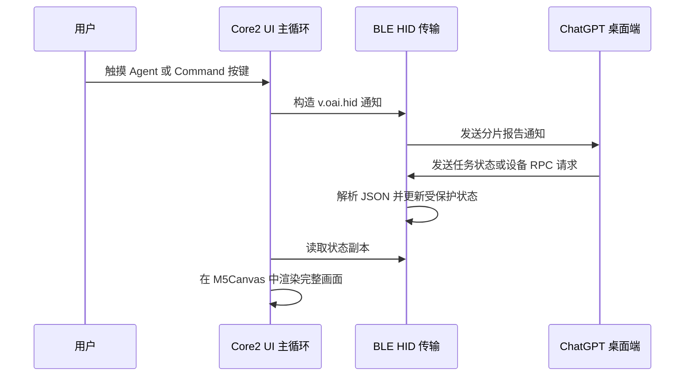

# 技术说明

[English](TECHNICAL.md)

本文档描述本仓库中固件的具体实现。相关厂商没有公开线缆协议，因此以下内容是
实际观察和兼容行为记录，不是稳定或官方的 API 规范。

## 系统概览

固件由两个主要层次组成：

1. `src/main.cpp` 负责设备屏幕、自适应触摸区域检测、页面状态、电池轮询和渲染循环。
2. `src/CodexMicroBle.cpp` 负责 BLE 初始化、HID 描述符、报告分帧、JSON 解析、
   主机请求处理和向主机发送通知。

Arduino 主循环读取 BLE 状态的副本。连接状态和灯光数据可能在 BLE 回调中发生
变化，因此使用 FreeRTOS 互斥锁保护。

## 构建环境

PlatformIO 环境保持精简并锁定关键版本：

| 设置 | 值 |
| --- | --- |
| Core2 Platform / Board | `espressif32@6.13.0` / `m5stack-core2` |
| Tab5 Platform / Board | Pioarduino `55.03.39` / `m5stack-tab5-p4` |
| Framework | Arduino |
| 串口监视器 | 115200 baud |
| 烧录速度 | 1,500,000 baud |
| 屏幕和硬件库 | `M5Unified 0.2.10` |
| JSON 库 | `ArduinoJson 6.21.5` |

Core2 使用 Arduino-ESP32 2.x Bluedroid；Tab5 使用 Arduino-ESP32 3.3.9 NimBLE，
通过 SDIO 上的 ESP-Hosted 访问 ESP32-C6 控制器。代码在编译期适配两套 BLE API。
升级 ESP32 平台可能改变 BLE 字段序列化、回调 API、内存占用或配对行为，升级后
必须在清除主机配对记录的情况下重新验证。

## BLE HID 设备标识

设备以通用 BLE HID 设备进行广播，并使用以下兼容性参数：

| 字段 | 值 |
| --- | --- |
| 设备名称 | `Codex Micro` |
| 制造商字符串 | `Work Louder` |
| Vendor ID | `0x303A` |
| Product ID | `0x8360` |
| PnP 来源 | `0x02` |
| HID Usage Page | Vendor Defined `0xFF00` |
| Application Usage | `0x01` |
| Report ID | `6` |
| Input Report Body | 63 字节 |
| Output Report Body | 63 字节 |

这些名称和标识没有分配给本项目。固件仅为满足主机兼容性检测而发送这些值。
请勿将它们用于无关产品，也不要暗示设备属于官方硬件。

Arduino-ESP32 2.x 对 PnP 字段的序列化字节序与 BLE PnP Characteristic 不同。
实现中预先交换 16 位 VID、PID 和版本值的字节序，使 macOS 最终读取到预期数值。

## HID Report Descriptor

描述符定义了一个 Vendor Defined Application Collection，其中包含一个 63 字节
Input Report 和一个 63 字节 Output Report，Report ID 为 6。所有数据项的 Report
Size 都是 8 位，逻辑范围为 0 到 255。

在常规 BLE HOGP 路径中，Report ID 用于选择 Characteristic，不包含在 63 字节
Characteristic Value 中。接收代码也兼容 64 字节形式，即主机桥接层在最前面显式
保留 Report ID 6 的情况。

## 传输分帧

每个 Report Body 的布局如下：

| 偏移 | 大小 | 含义 |
| --- | --- | --- |
| 0 | 1 字节 | 消息类型，当前为 `2` |
| 1 | 1 字节 | Payload 长度，范围 `0` 到 `61` |
| 2 | 最多 61 字节 | UTF-8 JSON 分片 |
| 剩余部分 | 可变 | 补零到 63 字节 Report Body |

发送时在 JSON 末尾添加 `\n`，按最多 61 字节分片，并以固定 63 字节 Input
Notification 发送。相邻分片之间延迟 4 ms。

接收时将 Output Report 追加到字符串缓冲区，再使用 4096 字节的
`DynamicJsonDocument` 解析。遇到 `IncompleteInput` 时保留缓冲区并等待下一分片。
如果新分片以 `{"method"` 开始，会清除尚未完成的旧缓冲区，从丢失的请求中快速
恢复。遇到错误 JSON 时会清空缓冲区，并将解析错误写入串口日志。

当前传输层没有序号、确认、校验和、重传、流量控制协商、BLE 之上的额外加密，
也没有对累计字符串缓冲区设置最大长度限制。

## RPC 消息

消息采用紧凑的类 JSON-RPC 结构。主机请求包含 `method`，通常还包含 `params`
和 `id`。响应回传 `id`，并包含 `result` 或 `error`。设备主动事件不包含 `id`。

### 设备到主机

| Method | 参数 | 用途 |
| --- | --- | --- |
| `v.oai.hid` | `k`：按键 ID，`act`：动作，可选 `ag`：Agent 序号 | 按下或释放按键 |
| `v.oai.rad` | `a`：归一化角度，`d`：距离 | 按下或释放摇杆方向 |

固件使用的按键动作值：

- `act = 0`：释放
- `act = 1`：按下
- `act = 2`：旋钮步进一次

Agent ID 为 `AG00` 至 `AG05`。默认 Command ID 为 `ACT06`、`ACT07`、
`ACT08`、`ACT09`、`ACT10` 和 `ACT12`。旋钮 ID 为 `ENC_CC`、`ENC_CW`
和 `ENC`。

方向角度使用归一化圆周值，而不是弧度：

| 方向 | 角度 | 按下距离 | 释放距离 |
| --- | ---: | ---: | ---: |
| 右 | `0.00` | `1.0` | `0.0` |
| 下 | `0.25` | `1.0` | `0.0` |
| 左 | `0.50` | `1.0` | `0.0` |
| 上 | `0.75` | `1.0` | `0.0` |

### 主机到设备

| Method | 行为 |
| --- | --- |
| `sys.version` | 返回 `0.2.0-core2` 或 `0.2.0-tab5` |
| `device.status` | 返回版本、Profile、Layer、电池和充电状态 |
| `v.oai.thstatus` | 更新 6 个 Agent 状态灯中的一个或多个 |
| `v.oai.rgbcfg` | 保存主机下发的环境灯光和按键灯光配置 |
| `lights.preview` | 返回成功；未实现物理灯光预览 |
| `host.focused_app` | 返回成功；未实现本地应用相关行为 |

未知方法返回错误码 `-32601` 和消息 `Method not found`。

### 任务灯光状态

每个 `v.oai.thstatus` 数组元素可以包含：

| Key | 类型 | 含义 |
| --- | --- | --- |
| `id` | 0 至 5 的整数 | Agent 槽位 |
| `c` | 24 位整数 | RGB 颜色 |
| `b` | 浮点数 | 亮度系数 |
| `e` | 字符串 | 效果名称，包括 `off` 或 `breath` |
| `s` | 浮点数 | 主机提供的效果速度 |

界面会使用颜色、亮度和 `breath` 效果。固件保存了效果速度，但当前呼吸动画使用
固定的本地计时函数。环境灯光和按键灯光配置仅为协议兼容而保存，因为 Core2
没有对应的逐键灯光硬件，所以不会进行渲染。

## 输入映射

屏幕包含三个页面。可以使用底部标签或 Core2 的 A、B、C 触摸按钮切换页面。

触摸命中区域根据当前横屏尺寸计算。Agent Key、Command Key、方向控件和
旋钮按下都会发送按下与释放事件。旋钮旋转控件在触摸时立即发送一次步进动作。

固件本地不计算双击间隔，也不判断打开设置所需的 500 ms 按住时间。固件发送
普通的按下和释放事件，由 ChatGPT 桌面端解释手势持续时间和点击序列。

## 屏幕渲染流程

界面以横屏方向渲染到全屏 16 位 `M5Canvas`（Core2 为 320 x 240，Tab5 为
1280 x 720），几何和文字大小由屏幕尺寸计算。Sprite 在 `M5.begin()`
之后分配，确保屏幕尺寸和 PSRAM 已完成初始化。每次更新按以下顺序进行：

1. 清空屏外 Canvas。
2. 绘制顶部状态栏、当前页面、状态动画和底部标签。
3. 将完整 Sprite 一次性推送到物理屏幕。

这种全帧双缓冲可避免直接绘屏时先清除再重绘产生的明显闪烁。如果分配失败，
固件会停止运行，并直接在 LCD 上显示 `Canvas allocation failed`。

存在 `breath` 效果的任务状态大约每 80 ms 重绘一次。其他页面仅在触摸输入、
连接变化或主机状态变化时重绘。

## 电池与电源

设备电池电量和充电标志在启动时读取，此后每 30 秒更新一次。Tab5 会过滤有效的
INA226 样本，并在读取暂时失败时保留最后一次有效电量。如果从未取得有效样本，
或 Tab5 报告未安装电池时的满量程电压且电池电流为零，本机标题栏会显示闪电符号
和 `USB`，而不是虚构电池百分比。此状态仍会向主机报告 100% 且未充电，因为 HID
Battery Characteristic 无法安全地向支持的操作系统表示未知或未安装电池的状态。

连接状态下会更新标准 BLE HID Battery Characteristic，`device.status` 同时返回
缓存的电量百分比和充电状态。

## 配对与安全

BLE Stack 使用 `ESP_IO_CAP_NONE` 请求绑定，因此配对采用没有 Passkey 验证的
“Just Works”流程。这种方式适合键盘类外设快速配对，但无法通过显示或输入代码
验证用户身份。请只在可信的物理和无线环境中配对。

按住右上角连接状态 3 秒会调用传输层的本地绑定清除操作。固件先暂停广播并断开
活动连接，然后删除全部绑定记录。Core2 枚举并删除 Bluedroid 绑定记录；Tab5
枚举 NimBLE 已绑定对端，并调用 `ble_store_util_delete_peer()` 逐一删除。操作完成后在同一运行周期恢复广播。
界面会显示 5 秒成功或失败提示，并提醒用户另外删除主机端的蓝牙记录。

固件不包含 Wi-Fi 凭据、OpenAI API 客户端、遥测或更新服务。它只向已连接的 BLE
主机发送控制事件和设备状态。主机行为、麦克风访问和任务数据由 ChatGPT 桌面端
及操作系统负责。

## 验证基线

当前实现已完成以下检查：

- M5Stack Core2 实机蓝牙连接
- macOS 将 HID 枚举为 VID `0x303A`、PID `0x8360`、Usage Page `0xFF00`
- ChatGPT 桌面端识别和 BLE 重新连接
- `host.focused_app` 和 `device.status` 请求处理
- Agent、Command、导航和旋钮触摸事件生成
- 全屏 Canvas 分配和屏幕渲染
- PlatformIO Release 编译和设备烧录

最近一次验证日期为 2026 年 7 月 16 日。验证时没有记录具体 ChatGPT 桌面端
Build Number，因此发布新固件前应再次使用最新桌面端测试协议兼容性。

## 已知限制

- 仅 BLE，不支持 USB HID 传输
- 同一时间只允许一个主机连接
- 不支持用户选择多个蓝牙槽位
- 不支持常规键盘按键或文字输入
- 使用四个数字方向键代替连续模拟摇杆
- 没有物理旋钮，旋转由触摸按钮模拟
- 没有环境灯或逐键 LED
- 不支持额外 Work Louder Layer 或 Work Louder 配置
- 没有 OTA 更新或回滚机制
- 在主机端重新映射 Command 后，屏幕标签不会自动更新
- 兼容性依赖主机私有行为，可能随时失效

## 扩展实现

修改协议层时建议遵守以下原则：

1. 在文档中区分实际观察到的线上数值和推断出的语义。
2. 除非计划清除 macOS 配对并完整复测，否则不要更改 HID 描述符和设备标识。
3. 新增接收缓冲区时必须设置上限，并在解析前校验分片长度。
4. 不要在 BLE 回调中执行耗时屏幕绘制；只更新受保护状态，在主循环中渲染。
5. 在实机上验证按下与释放配对、断线恢复、电池上报和未知 RPC 响应。
6. 修改描述符后，在主机上忽略设备并重新配对，以刷新缓存的设备元数据。

## 外部参考

OpenAI 在
[Codex Micro](https://learn.chatgpt.com/docs/features/codex-micro) 页面说明了官方
产品行为。该页面描述的是 OpenAI 和 Work Louder 的官方硬件，仅作为行为参考，
并未记录或授权本项目使用的兼容协议。
